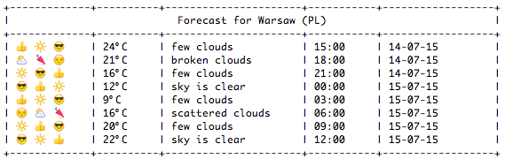

damn-weather
============
Get some damn :sunny: :sunglasses: :zap: :thumbsup: !
----------------------------------------------------------------------
This gem provides you with an easy and convenient way for checking weather forecast. It uses your ip address for locating you and http://openweathermap.org/ for fetching weather data.

Example output
--------------


Installation
------------
```sh
$ gem install damn-weather
```

Usage
-----
```
damn-weather                           one day forecast
damn-weather -f/--forecast [days]      forecast for [days]
damn-weather -n/--now                  weather right now
damn-weather -v/--version              display gem version
damn-weather -h/--help                 help message
```

License
-------
MIT
